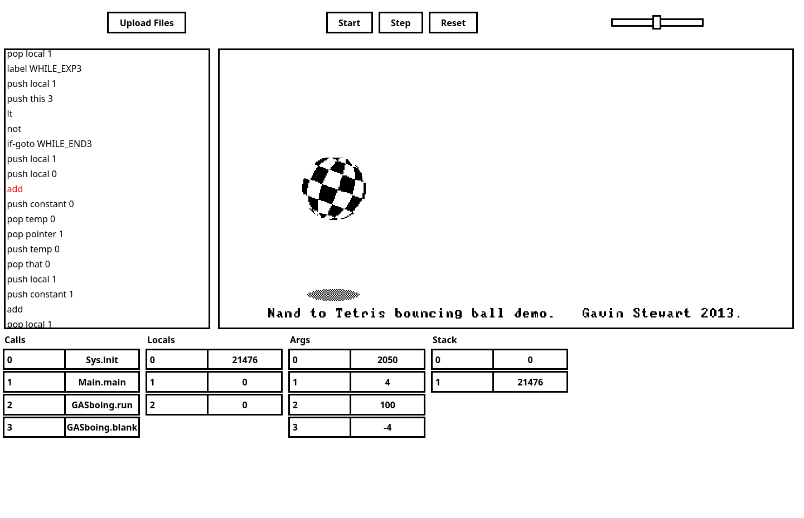

# VM development targeting the web browser with Rust and WebAssembly

A Nand to Tetris Emulator implementation that can run in the browser or on your Desktop

The application is hosted on https://funkschy.github.io/nand-to-browser/

# Usage
## Web
When you open [the application](https://funkschy.github.io/nand-to-browser/), initially no program is loaded.
To use the emulator, you must click the Upload Files button and select all the .vm files for your program (or a single .asm file to use the CPU emulator).
After you select the files and click Open, the program will automatically load into the emulator ROM, unlocking the Start, Step, and Reset buttons.

When you click Start, the program will run in a loop, with the speed determined by the slider at the top right of the application. While the program is running, the Start button is changed to Stop and the Step button is disabled. Furthermore, the screen is maximized and the information about RAM and ROM is hidden.

The Step button advances the emulator by a single instruction, updating the bytecode view on the left side of the screen and the memory cells at the bottom after each step.
This is mainly meant for debugging.

Reset simply resets the emulator to the state immediately after loading the program.

The speed of the running emulator can be adjusted at any time with the slider at the top right.



### VM
``` shell
target/release/vm <DIR or tst FILE>
```
If the path to a directory is passed to the application, it will read all the vm files contained in that directory and execute them. This will either happen in headless mode, or if the desktop feature was set during compilation, a new window will open and display the screen.
If a filepath is passed instead, the application checks if the filepath leads to a tst file and if it does, that tst file is executed. Unlike the official implementation, the stdlib will actually be loaded automatically here.
In any other case, an error message is displayed and the application will be terminated.

### CPU
``` shell
target/release/cpu <tst file>
```
The CPU emulator can only be used with a Test script, so that is the expected argument.
This should be equivalent to the official emulator.

To get a list of all available options just run `target/release/[cpu|vm] --help`

# Dependencies
## General
- [Rust](https://www.rust-lang.org/)
## Web
- [wasm-pack](https://rustwasm.github.io/wasm-pack/installer/)
- [npm](https://github.com/npm/cli)
## Desktop
- [SDL2](https://www.libsdl.org/)

# Building the emulator
First install the relevant dependencies listed above.

## Web Mode

To use the web version, we need to build a WebAssembly library and then host the Javascript frontend with some file server (npm run start will start the webpack development server)

``` shell
# switch into the web ui folder
cd www
# compile the rust code into a wasm lib
wasm-pack build --release
# pull the javascript dependencies
npm ci
# run the javascript server
npm run start
```

Then just open [localhost on port 8080](http://localhost:8080) in your browser

## Desktop Mode
``` shell
# for headless mode (to only run test scripts without seeing the UI)
cargo build --release

# compile the application into a desktop version
# for desktop mode (with a graphical user interface)
cargo build --release --features desktop
```
This will actually produce two different binaries inside the target/release directory. One for the VM Emualtor and one for the CPU emulator.
